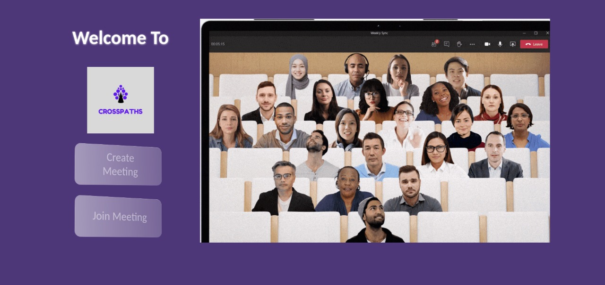
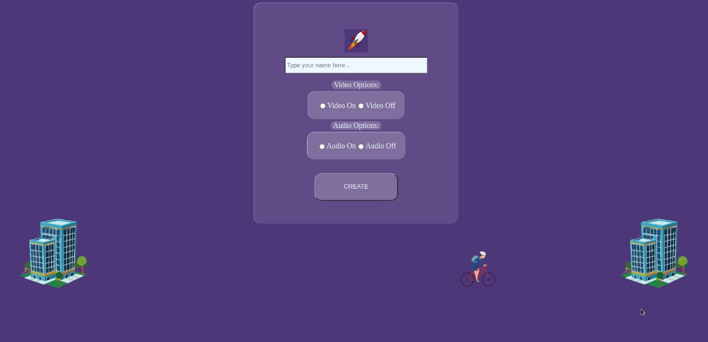
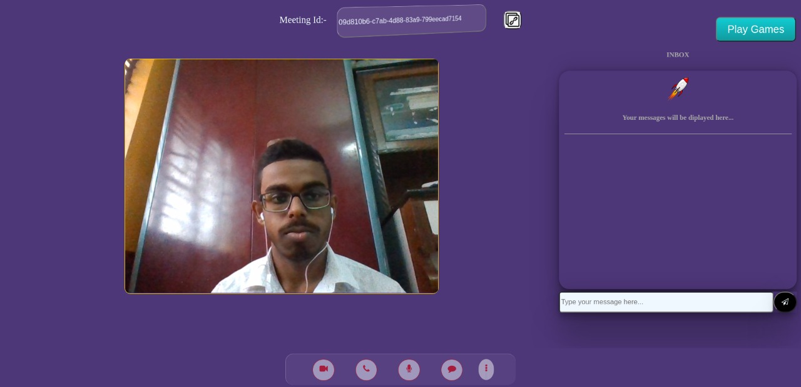
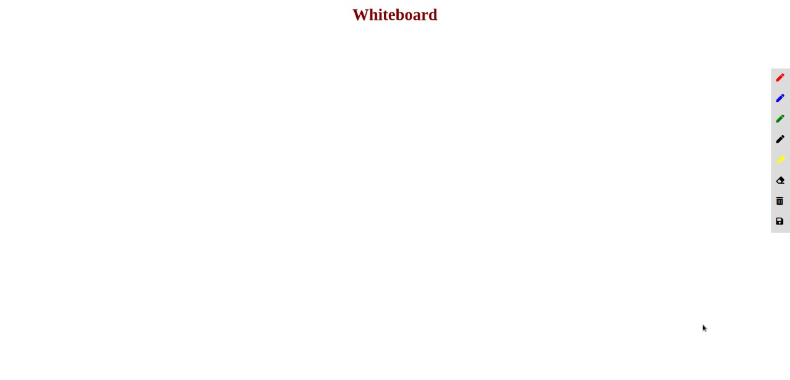
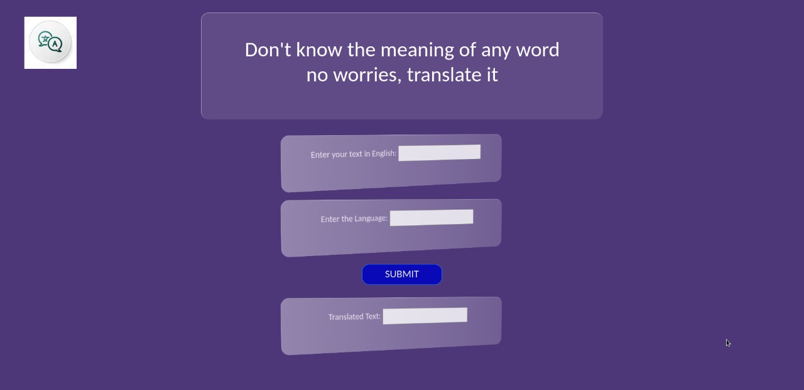
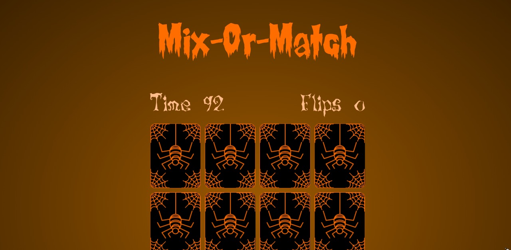
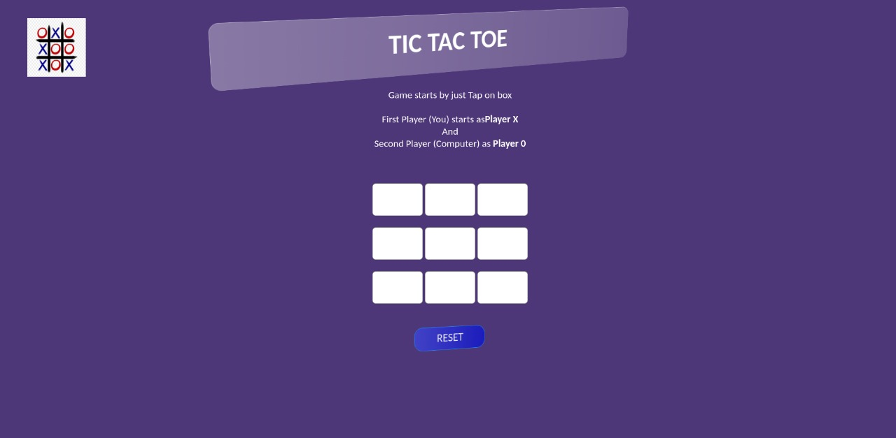
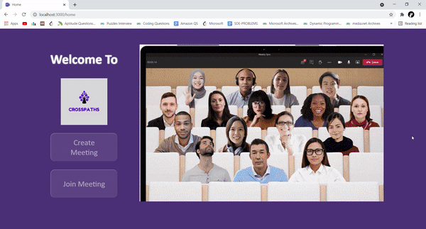

# Crosspaths
A Video chat app built using NodeJs, WebRTC and Firebase. The user experience is as simple as possible. Users do not have to sign up. They can simply create or join meeting with their name and preferred audio/video settings. Some of the features include:
- Video calling with 2 or more users
- Chat during an ongoing meeting 
- Control video and audio settings
- Record the meeting
- Alert other users when meeting is being recorded
- Games like Tic-tac-toe are present to counter boredom
- Translator integrated to break the barrier of language
- Current affairs page to keep students updated about the outside world
- Whiteboard integrated with the site
- Share screen with other participants
- Invite others directly from site by meeting ids

# Snapshots of the site: 
## Home Page:

## Enter name and video/audio preferences and create/join a meeting:

## The meeting page: 

## Whiteboard

## Translator

## Mix-or-match

## Tic-tac-toe

## Glassmorphism

# Contributors
Anirban Sikder

Anish De

Sounak Majumder

Devtanu Misra

Ahel Das Chatterjee
